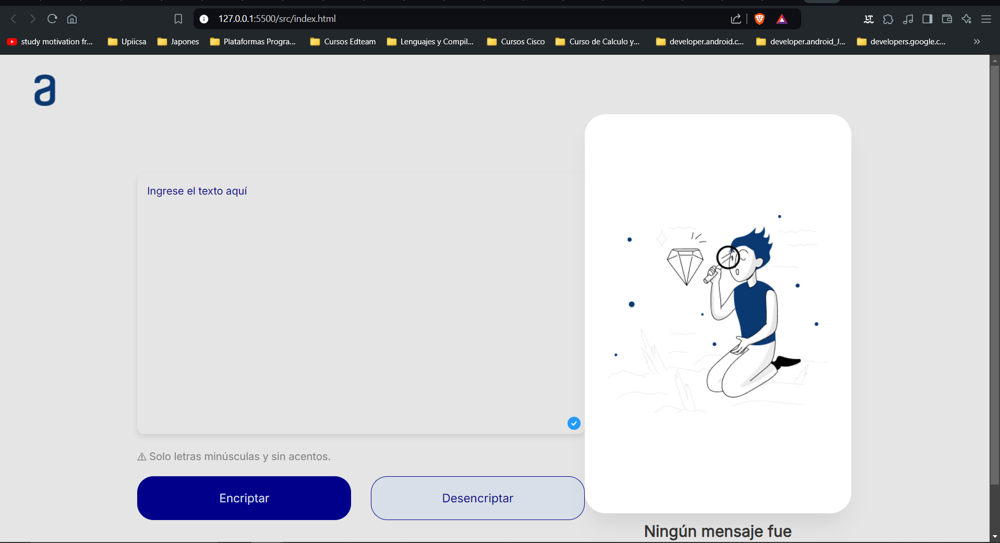

# Mi Proyecto

Este es el archivo README para mi proyecto. Aquí se muestran ejemplos de cómo agregar imágenes y videos.

## Imágenes

## Videos

<video width="320" height="240" controls>
  <source src="videos/video.mp4" type="video/mp4">
  Tu navegador no soporta el formato de video.
</video>
